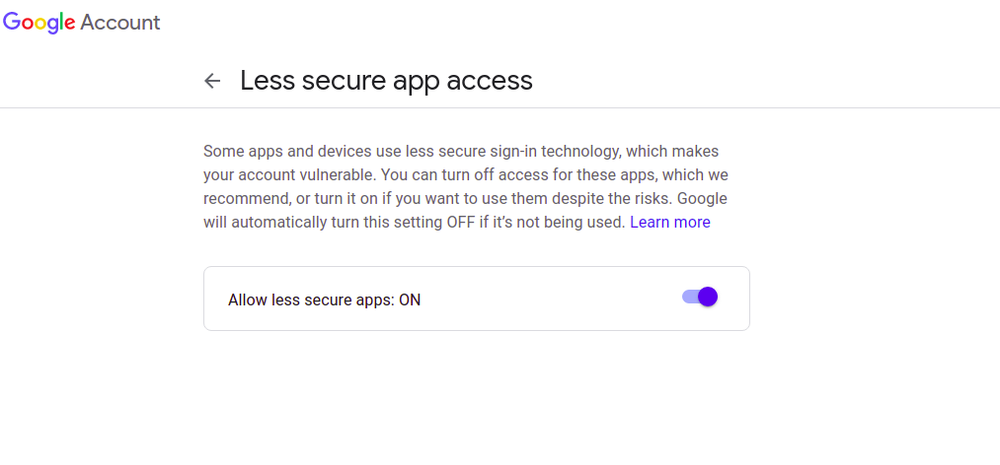

1. Open the project using IntelliJ or Eclipse
2. Go to the Application.properties
3. add your email and password to below properties  
   `spring.mail.host=smtp.gmail.com (if it is email, otherwise it would be your email host)`  
   `spring.mail.username=your gmail/ apikey`  
   `spring.mail.password=your password / api secret`    
   
4. Go to your email and turn on  `Allow less secure apps: ON` [click the link](https://myaccount.google.com/u/3/lesssecureapps?pli=1&rapt=AEjHL4N_3V70CcKkElT8VP2mrMcZC0ltqEw6B908kgaW0sWH_qfJpzQhXXbqhjihVs_tKHLnLuyO_15xa4YBVuDBT0HXsCHPig)

   

5. Open the `EmailController.java` and set the to address (example@gmail.com), if you want you can integrate it with Database later  
6. You can set any property in `EmailController.java` and use it in the html code once you carefully read the code
7. Run the application and test with [rest call](http://localhost:8080/sendemail)

## example for [Mailtrap](https://mailtrap.io/inboxes)

1. Go and create an account
2. Go to My Inbox
3. Go to SMTP / POP3
4. Select the `Play-Mailer` under the Java, Scala
5. You can see properties as below
   ```
      play.mailer {
      host = "smtp.mailtrap.io"
      port = 2525
      ssl = no
      tls = yes
      user = "xxxx"
      password = "yyyy"
      }
   ```
6. Change `application.properties` values according to above
   ```
      spring.mail.host=smtp.mailtrap.io
      spring.mail.port=2525
      spring.mail.username=xxxx
      spring.mail.password=yyyy
   ```
7. Once you send the email, you can check the inbox of Mailtrap  

8. Goto the EmailExecutorServiceImpl class and edit the relevant details

9. Run the db_script.sql

10. curl commands for test

```
curl --location --request GET 'http://localhost:8080/v1/mail/send-with-template'
```

```
curl --location --request GET 'http://localhost:8080/v2/users/1/mail/send-with-template'
```

```
curl --location --request GET 'http://localhost:8080/v1/mail/send-without-template'
```


